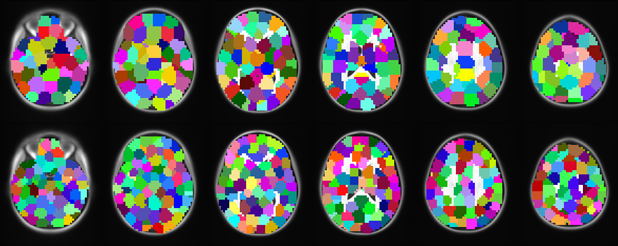
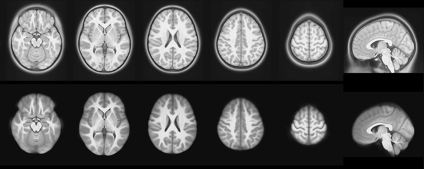
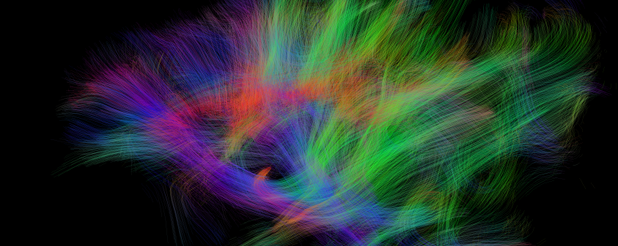
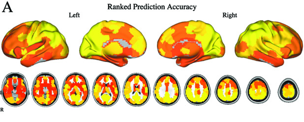

    

        
        
        
        <a href="http://www.ncbi.nlm.nih.gov/pubmed/?term=23707580" target="_blank">
        <!--<a href="" target="_blank"> -->
    

    <!--
    

        <strong><a href="#">Predicting intrinsic brain activity</a>. 
    

    -->

The Computational Neuroimaging Lab is a subdivision of the [Center for Biomedical Imaging and Neuromodulation](http://claymore.rfmh.org/) at the [Nathan S. Kline Institute from Psychiatric Research](http://www.rfmh.org) and the [Center for the Developing Brain](http://www.childmind.org/en/center-for-developing-brain/) at the [Child Mind Institute](http://www.childmind.org). The lab's research agenda involves the development of novel computational analysis and experimental techniques for determining how brain function and structure are impacted by mental illness and development. Ongoing projects involve developing real-time fMRI experiments to evaluate the interaction between brain networks, applying machine learning and signal processing methods to map inter-individual variation in the human connectome, and optimizing MRI acquisition for pediatric and psychiatric populations. Additionally, the CNL is a strong supporter of open science as exemplified by developing the <a href="http://fcp-indi.github.io">Configurable Pipeline for the Analysis of Connectomes</a> open source software package, openly sharing data through the <a href="http://fcon_1000.projects.nitrc.org">International Neuroimaging Datasharing Initiative</a>, and spearheading the <a href="http://preprocessed-connectomes-project.github.io">Preprocessed Connectomes Project</a>.

